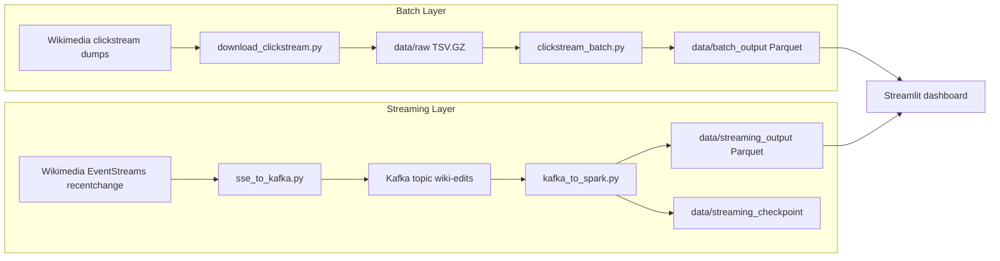
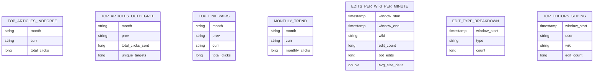

# Wikipedia Clickstream Insights: Live Edit Monitoring and Historical Clickstream Analytics

## Project Overview

This project is a Wikipedia analytics platform built around two complementary views of Wikimedia activity:

- Real-time edit monitoring: follow live edit traffic from Wikimedia EventStreams as it lands in Kafka, is aggregated by Spark Structured Streaming, and becomes available in a Streamlit dashboard.
- Historical clickstream analysis: process monthly Wikimedia clickstream dumps with PySpark to understand which articles attract the most inbound traffic, which pages send the most users onward, and how article popularity changes month over month.

The system uses a lambda-style architecture so you can study both long-horizon navigation behavior and short-horizon editorial activity in one project.

The platform serves two primary analytical purposes.

### Real-Time Edit Monitoring

Using the Wikimedia recentchange EventStreams feed, the project reconstructs a live view of edit activity and surfaces operational signals such as:

- Edit rate by wiki in 1-minute windows
- Bot versus human activity trends
- Top human editors over sliding windows
- Edit type breakdown across edit, new, and categorize events

This makes the streaming side useful both as a learning project for event-driven pipelines and as a lightweight observability surface for Wikipedia activity.

### Historical Clickstream Analysis

The batch layer processes monthly clickstream TSV dumps to answer questions about navigation behavior, including:

- Which articles receive the most inbound clicks in a given month
- Which articles send the most outbound traffic to other pages
- Which source-target article pairs dominate click volume
- How article traffic changes over time across the months you load

Together, the batch and streaming layers show how to combine historical and live Wikimedia data in a single analytics workflow.

## Motivation

Wikipedia is one of the richest free public datasets available for learning data engineering. It exposes both historical navigation behavior and live editorial events, which makes it a strong fit for demonstrating batch analytics, streaming ingestion, data quality enforcement, and dashboard delivery inside one reproducible local project.

This project was built to make those ideas concrete with tools that are practical to run on a laptop: PySpark for large-file analytics, Kafka for event transport, and Streamlit for direct visualization of parquet outputs.

## Project Scope

The project comprises 3 major sections:

- Historical batch pipeline using Wikimedia clickstream dumps, local storage, and PySpark
- Real-time streaming pipeline using Wikimedia EventStreams, Kafka, and Spark Structured Streaming
- Streamlit dashboard for interactive visualization of both batch and streaming outputs

## Dataset Choices

This project intentionally combines two Wikimedia datasets because each answers a different class of question.

| Data source | Data source type | Cost | Freshness | Best use | Advantages |
| --- | --- | --- | --- | --- | --- |
| Wikimedia clickstream dumps | Monthly TSV.GZ files | Free | Monthly | Historical navigation analysis | Large-scale article-to-article traffic, stable monthly snapshots, ideal for batch processing |
| Wikimedia EventStreams recentchange | Server-Sent Events stream | Free | Near real time | Live edit monitoring | Continuous event feed, supports reconnect with Last-Event-ID, good fit for Kafka and streaming windows |

The project uses both because the clickstream dumps explain how readers move through Wikipedia over time, while EventStreams captures how the encyclopedia is being edited right now.

## High-Level Architecture Diagram



## Technology Choices

### Real-Time Streaming Pipeline

The real-time component uses Kafka and Spark Structured Streaming because they map well to the characteristics of Wikimedia edit events.

#### Kafka

Kafka is used as the event transport layer between the SSE producer and Spark. It was chosen because it provides:

- Durable buffering between ingestion and processing
- Back-pressure tolerance when Spark temporarily lags
- Partitioned transport for scalable event handling
- A natural integration point for Spark Structured Streaming

The SSE producer assigns deterministic Kafka message keys so duplicates can be removed downstream using watermark-bounded deduplication.

#### Spark Structured Streaming

Spark Structured Streaming powers the live aggregations because it can:

- Parse and validate JSON events from Kafka
- Use event-time windows for accurate time-based metrics
- Apply watermarking and deduplication to at-least-once streams
- Write continuously updated parquet sinks that Streamlit can read directly

Current streaming outputs include:

- edits_per_wiki_per_minute
- edit_type_breakdown
- top_editors_sliding

### Historical Batch Analytics

The historical analytics layer uses PySpark because Wikimedia clickstream dumps are large enough that schema enforcement, aggregation pushdown, and distributed-style APIs are useful even in local mode.

The batch job was designed around a few practical goals:

- Idempotent partitioned writes using dynamic partition overwrite
- Efficient parquet output for downstream dashboard reads
- Built-in data-quality quarantine before analytics are computed
- Resource settings that make local processing of large monthly files more stable

### Interactive Visualization

The visualization layer uses Streamlit with Plotly because the project outputs parquet files directly and benefits from a lightweight app that can read them without adding a separate serving layer.

The dashboard provides:

- A batch tab for clickstream leaderboards and monthly trends
- A streaming tab for live edit KPIs and windowed charts
- Cached reads with short TTLs for fast local iteration

## Data Model and Output Tables

The project does not load into a warehouse. Instead, it materializes parquet datasets that act as presentation-ready analytical outputs.



## Data Ingestion

The ingestion layer has two separate paths.

### Batch Ingestion

The batch downloader pulls monthly TSV.GZ files from Wikimedia dumps into data/raw.

Key ingestion behaviors:

- Builds deterministic URLs from the configured wiki and month list
- Skips already downloaded files when they are still valid gzip archives
- Detects partial or corrupt downloads and re-downloads them
- Writes to a temporary file first and renames only after the download succeeds

### Streaming Ingestion

The streaming producer tails the Wikimedia recentchange SSE feed and publishes JSON messages into Kafka.

Key ingestion behaviors:

- Reconnects automatically after transient failures
- Sends Last-Event-ID on reconnect to resume within the replay window
- Filters to a configured wiki, currently enwiki by default
- Enriches each event with an ingestion timestamp before publishing
- Uses deterministic Kafka keys so downstream deduplication is cheap and reliable

## Data Quality and Validation

The batch path includes a data-quality contract before any analytical aggregation runs.

The validation rules are:

- prev must be non-null and non-empty
- curr must be non-null and non-empty
- type must be one of link, external, or other
- n must be a positive integer
- month must match the YYYY-MM pattern

Records that violate any contract rule are quarantined to data/quarantine/clickstream partitioned by month, and are excluded from the clean analytical dataset.

This gives the project a clear bronze-to-silver style handoff:

- raw clickstream files are ingested into Spark
- invalid records are isolated with reason strings
- only validated rows feed the batch analytics outputs

## Data Transformation

The transformation logic is split across the batch and streaming layers.

### Batch Transformations

The batch job applies:

- Schema enforcement for prev, curr, type, and n
- Month extraction from source filenames
- Top-N ranking per month using window functions
- Aggregations for inbound clicks, outbound clicks, link pairs, and monthly trends
- Partitioned parquet writes for efficient reads by the dashboard

The main batch outputs are:

- top_articles_indegree
- top_articles_outdegree
- top_link_pairs
- monthly_trend

### Streaming Transformations

The streaming job applies:

- JSON schema parsing for recentchange payloads
- Event-time conversion from unix timestamps
- Size-delta derivation from old and new content lengths
- Watermark-bounded deduplication using Kafka message keys
- Tumbling and sliding window aggregations for live metrics

The main streaming outputs are:

- edits_per_wiki_per_minute
- edit_type_breakdown
- top_editors_sliding

## Project Layout

```text
wiki_clickstream_project/
|-- config.py
|-- README.md
|-- requirements.txt
|-- batch/
|   |-- clickstream_batch.py
|-- dashboard/
|   |-- app.py
|-- docker/
|   |-- docker-compose.yml
|-- ingestion/
|   |-- data_quality.py
|   |-- download_clickstream.py
|   |-- sse_to_kafka.py
|-- streaming/
|   |-- kafka_to_spark.py
`-- data/
  |-- raw/
  |-- batch_output/
  |-- streaming_output/
  `-- streaming_checkpoint/
```

## Setup and Run

### Prerequisites

| Tool | Version | Notes |
| --- | --- | --- |
| Python | 3.10+ | Required for the project scripts and dashboard |
| Java | 11 or 17 | Required by Spark |
| Apache Spark | 3.5+ | Must be available on PATH for local execution |
| Docker Desktop | Recent | Used for the local Kafka stack |

Install dependencies:

```bash
pip install -r requirements.txt
```

### Step 1: Start Kafka

```bash
cd docker
docker compose up -d
```

Kafka UI is available at http://localhost:8080.

### Step 2: Download historical clickstream data

Adjust the month list in config.py if needed, then run:

```bash
python ingestion/download_clickstream.py
```

### Step 3: Run the batch Spark job

```bash
python batch/clickstream_batch.py
```

This writes parquet outputs under data/batch_output.

### Step 4: Start the SSE to Kafka producer

```bash
python ingestion/sse_to_kafka.py
```

### Step 5: Start the Spark Structured Streaming job

```bash
python streaming/kafka_to_spark.py
```

Or, if you prefer spark-submit:

```bash
spark-submit --packages org.apache.spark:spark-sql-kafka-0-10_2.12:3.5.4 streaming/kafka_to_spark.py
```

### Step 6: Launch the Streamlit dashboard

```bash
streamlit run dashboard/app.py
```

## Dashboard Views

### Batch Dashboard

The batch tab provides:

- Top 20 articles by inbound clicks
- Top 20 articles by outbound clicks
- Top 20 article link pairs
- Monthly trend for the top articles across loaded months

### Streaming Dashboard

The streaming tab provides:

- KPI tiles for total edits, bot edits, bot share, and latest window
- Edit-rate visualization for enwiki
- Edit-type breakdown charts
- Top editors for the latest sliding window

## Configuration Reference

The main settings live in config.py.

| Setting | Description |
| --- | --- |
| CLICKSTREAM_MONTHS | Months to download for historical analysis |
| CLICKSTREAM_WIKI | Wiki dump to download, currently enwiki |
| RAW_DATA_DIR | Raw dump storage location |
| BATCH_OUTPUT_DIR | Batch parquet output location |
| QUARANTINE_DIR | Quarantine path for failed data-contract records |
| BATCH_PARTITION_OVERWRITE_MODE | Controls idempotent overwrite behavior |
| KAFKA_BOOTSTRAP_SERVERS | Kafka bootstrap address |
| KAFKA_TOPIC_EDITS | Kafka topic for streamed edit events |
| EVENTSTREAMS_URL | Wikimedia recentchange SSE endpoint |
| EVENTSTREAMS_WIKI_FILTER | Optional filter for a single wiki |
| SPARK_MASTER | Spark execution target |
| SPARK_KAFKA_PACKAGE | Kafka connector package for Spark |
| STREAMING_CHECKPOINT_DIR | Structured Streaming checkpoint path |
| STREAMING_OUTPUT_DIR | Structured Streaming parquet sink path |

## Why These Design Choices

### Why use both batch and streaming data?

Because the questions are different. Monthly clickstream data is best for navigation and popularity analysis, while live SSE events are best for monitoring editorial activity as it happens.

### Why parquet files instead of a warehouse?

For this project, parquet keeps the system lightweight and local. Spark can write it efficiently, and Streamlit plus pandas can read it directly without adding another serving layer.

### Why Kafka in a local project?

Kafka introduces the same decoupling pattern used in larger streaming systems. It lets ingestion and processing evolve independently and gives Spark a reliable source even when the SSE feed reconnects.

### Why a quarantine zone?

The batch data-quality gate prevents malformed rows from contaminating the analytical outputs. That matters when the same parquet outputs are read directly by a dashboard.

## Challenges and FAQs

### How is the streaming job protected from duplicate events?

The SSE producer assigns deterministic Kafka keys, and the Spark job applies watermark-bounded dropDuplicates on those keys.

### What happens if Kafka loses old offsets after a restart?

The streaming consumer sets failOnDataLoss to false so the job skips missing offsets instead of crashing when checkpoints point to data Kafka has already purged.

### How are repeated batch runs kept safe?

Batch outputs use dynamic partition overwrite, so rerunning one month replaces only that month while leaving other historical partitions untouched.

### What happens to bad batch records?

They are written to the quarantine directory with a reason string and removed from the clean analytical dataset.

### Is this project only for enwiki?

No. The defaults are tuned for enwiki, but both the clickstream download target and EventStreams filter can be changed in config.py.

## Future Improvements

- Add richer article-level filters and drill-downs in the Streamlit dashboard
- Introduce Delta Lake or Iceberg for stronger table semantics
- Deploy Kafka and Spark to managed cloud infrastructure
- Add tests for expected output schemas and dashboard data contracts
- Replay historical data through Kafka to explore a fuller kappa-style design

## Data Sources

| Source | URL | Notes |
| --- | --- | --- |
| Wikimedia clickstream dumps | https://dumps.wikimedia.org/other/clickstream/ | Historical monthly article-to-article traffic |
| Wikimedia EventStreams recentchange | https://stream.wikimedia.org/v2/stream/recentchange | Live recent edit events |
